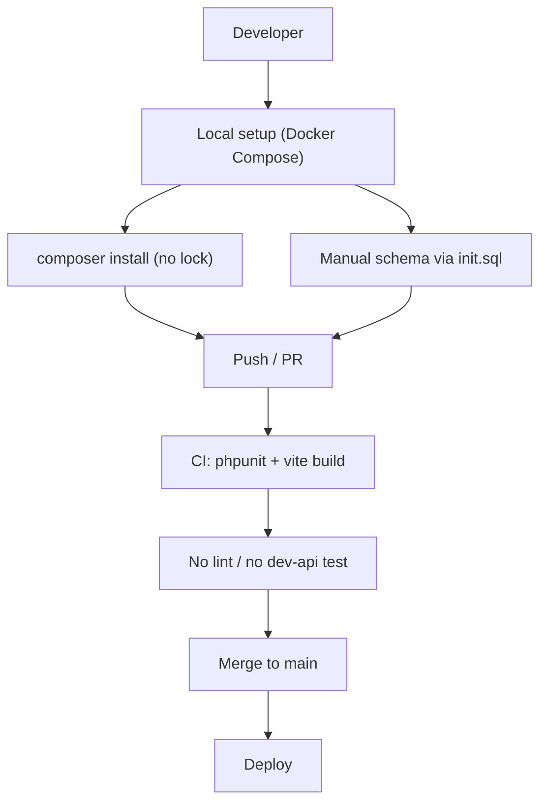
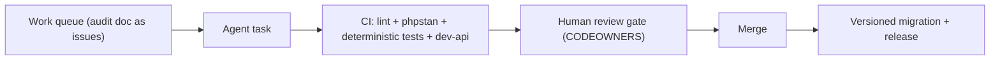

# 8. Technical Debt Analysis

**Objective:** Establish the prerequisites for an Agentic Harness & Marketplace initiative — code repository health, third-party tool usage, AI tool usage, database usage, and development environment readiness.

**Date:** 2026-07-27 | **Scope:** `shende-shweta/FSDKC` (read via GitHub) — polyglot monolith: PHP/Laravel 12 backend, Node/Express `dev-api`, React 19 + Vite + TypeScript frontend, MariaDB + MongoDB, Docker Compose

## Executive Summary

> **Executive Summary**
>
> FSDKC ("Klearcom") is a well-structured polyglot monolith with genuinely strong agentic scaffolding: five `AGENTS.md` guides, a symmetric Discovery/Connect module layout across backend and frontend, a working GitHub Actions CI pipeline, and Docker Compose for the full stack. That foundation makes it more agent-ready than most codebases of its age. The debt is concentrated in reproducibility and quality-gate depth rather than architecture. The three most severe gaps are: (1) **`backend/composer.lock` is not committed** (`git/trees/main` shows `composer.json` but no lock file), so every CI run and every developer install resolves PHP dependencies afresh via `composer install` — backend builds are not reproducible; (2) **no code-style / static-analysis enforcement exists** — there is no ESLint, Prettier, or Laravel Pint anywhere, and although `phpstan/phpstan ^2.0` is declared in `backend/composer.json` there is no `phpstan.neon` and it is never invoked in `.github/workflows/ci.yml`, so agent-authored code has no automated lint gate; (3) **the database has no migration framework** — the entire schema lives in a single `docker/mariadb/init.sql` that only executes on a fresh MariaDB volume, leaving no versioned, reversible path for schema evolution. There are also self-documented debts (a deliberately reintroduced `extract()` pattern, a non-deterministic test using `random_int()`, missing service/repository layers) catalogued in `docs/CODEBASE_AUDIT_ISSUES.md`. Overall the repo is **Moderate** readiness: a real CI gate exists and can be trusted for the frontend build, but the missing lock file, absent lint layer, and flaky/shallow tests mean agent-authored output cannot yet be verified with full confidence.

Yes

Top-Level .gitignore Present

1

CI/CD Workflows Found

19 / 18

Third-Party Packages Declared / Wired

No

frontend/.env.example Present

Overall Codebase Rating — Technical Debt &amp; Agentic Readiness

Moderate

Driven by a missing composer.lock (non-reproducible backend builds), no enforced lint/style gate, no DB migration framework, and a flaky/shallow test layer — no single dimension is High Risk, but every dimension carries real gaps.

## Readiness Benchmark Ratings

One row per readiness dimension. "Measured" is the real state found; "Rating" is the band it falls into (worst-wins). This table is the source for the Overall Codebase Rating banner above.

| # | Dimension | Good | Moderate | High Risk | Measured | Rating |
|---|---|---|---|---|---|---|
| D1 | Code Repository Health | all checks pass | 1–2 gaps | 3+ gaps / no CI | `.gitignore` + CI + JS lock files present; **`composer.lock` missing**, no CODEOWNERS/PR template, CI runs no lint step | Moderate |
| D2 | Third-Party Tool Usage | mostly wired & current | some unused/unwired | many unused/unmaintained | 18/19 packages wired; `phpstan` declared but no config and never run; `dotenv` redundant (`node --env-file` used) | Moderate |
| D3 | AI Tool / Agentic Readiness | ready | partial | not ready | 5 `AGENTS.md` + `.kiro/` config + symmetric enumerable modules; but CI verification gate is shallow (no lint, one flaky test, `dev-api` untested) | Moderate |
| D4 | Database Usage | sound | some gaps | no constraints / shared flat schema | FKs with `ON DELETE CASCADE` + Mongo indexes present; **no migration framework**, few secondary indexes, schema+seed combined & non-idempotent | Moderate |
| D5 | Development Environment | reproducible | partial | manual / fragile | Docker Compose + Dockerfiles + backend/dev-api `.env.example`; **no lint/formatter enforced**, no `frontend/.env.example`, `frontend/Dockerfile` uses `npm install` | Moderate |
| D6 | Automated Quality Gates & Test Determinism *(additional)* | lint+type+deterministic tests gate every PR | partial gate | no gate / flaky | CI runs `phpunit` + `tsc --noEmit` + `vite build`; but no lint, no coverage, `ReachabilityCalculationTest` uses `random_int()` (flaky), `dev-api` has zero tests | Moderate |

**Additional readiness gaps:** one additional dimension (**D6 — Automated Quality Gates & Test Determinism**) was observed beyond the five standard dimensions, driven by the flaky `random_int()` test (`backend/tests/Unit/ReachabilityCalculationTest.php:11-18`) and the absence of any lint/static-analysis step in CI. No further readiness gaps beyond these were observed.

## 8.1 Code Repository

| Check | Finding | Evidence / Consequence |
|---|---|---|
| `.gitignore` coverage | Present, adequate | `.gitignore` (top level) ignores `backend/vendor/`, `node_modules/`, `frontend/dist/`, `.env`, `dev-api/.env`, `backend/.env`, `*.log`. Dependency dirs, build output, and env files are all covered — low risk of committing secrets or local state. |
| CI/CD presence | Present but shallow | `.github/workflows/ci.yml` defines two jobs. **backend**: spins up MariaDB 11, sets up PHP 8.3, installs the MongoDB PECL ext, runs `composer install` then `vendor/bin/phpunit`. **frontend**: `npm ci \|\| npm install` then `npm run build` (`tsc --noEmit && vite build`). No lint job, no static analysis, no `dev-api` job — so lint regressions and `dev-api` breakage land unverified. |
| Branch protection signals | **Absent** | The only `.github/` content is `workflows/ci.yml`. No `CODEOWNERS`, no `PULL_REQUEST_TEMPLATE.md`, no visible required-checks config. Nothing enforces review or that CI passed before merge to `main`. |
| Lock files committed | **Partial** | `frontend/package-lock.json` (65 KB), `dev-api/package-lock.json` (54 KB), and root `package-lock.json` are committed. **`backend/composer.lock` is missing** — `composer install` with no lock resolves fresh each run, so backend dependency versions are not pinned and CI is not reproducible. |

## 8.2 Third-Party Tools Usage

Security- / infrastructure-relevant declared dependencies and whether they are actually wired into code.

| Package | Declared | Actually Wired? | Debt |
|---|---|---|---|
| `laravel/framework` ^12.0 (backend) | Y | Y | Core framework — routes, controllers, Eloquent models all use it. Current. |
| `mongodb/mongodb` ^2.0 (backend) | Y | Y | Wired via `backend/app/Services/MongoService.php` and `MongoController`. |
| `phpunit/phpunit` ^11.0 (backend, dev) | Y | Y | Invoked in CI (`vendor/bin/phpunit`) and `backend/phpunit.xml`. |
| `phpstan/phpstan` ^2.0 (backend, dev) | Y | **N** | **Declared but never used** — no `phpstan.neon` anywhere, no `phpstan analyse` step in CI. Pure dead dev-dependency giving a false impression of static-analysis coverage. |
| `@tanstack/react-query` ^5.62 (frontend) | Y | Y | Used in `frontend/src/hooks/useRealtimeTest.ts` and pages for data fetching/invalidation. |
| `react-router-dom` ^7.1 (frontend) | Y | Y | Routes defined inline in `frontend/src/App.tsx`. |
| `zustand` ^5.0 (frontend) | Y | Y | `frontend/src/store/uiStore.ts`. |
| `typescript` / `vite` / `@vitejs/plugin-react` (frontend, dev) | Y | Y | Build toolchain, exercised by `npm run build` in CI. |
| `express` ^4.21 (dev-api) | Y | Y | `dev-api/src/server.js` route handlers. |
| `cors` ^2.8 (dev-api) | Y | Y | Wired in the Express app. |
| `mongodb` ^6.12 (dev-api) | Y | Y | `dev-api/src/mongo.js`. |
| `mongodb-memory-server` ^10.1 (dev-api) | Y | Y | In-memory Mongo for local dev / seed. |
| `dotenv` ^16.4 (dev-api) | Y | **Redundant** | Declared, but every script runs `node --env-file=.env` (native env loading), so the `dotenv` package is not needed — dead dependency. |

Net: **18 of 19** declared packages are genuinely wired. The two debts (`phpstan` unwired, `dotenv` redundant) are low-effort removals or activations.

## 8.3 AI Tool Usage & Agentic Readiness

**Existing AI/agentic tooling — unusually mature for the repo's age:**

- **Five `AGENTS.md` guides**: root `AGENTS.md`, `backend/app/Modules/Discovery/AGENTS.md`, `backend/app/Modules/Connect/AGENTS.md`, `frontend/src/modules/Discovery/AGENTS.md`, `frontend/src/modules/Connect/AGENTS.md`. These give an agent per-module conventions to follow.
- **`.kiro/` configuration** present (`.kiro/settings/mcp-bundles/`), indicating prior agent-tooling / MCP-bundle setup.
- **A `.cursor/` directory** exists at the workspace root (Cursor editor config), signalling prior AI-assisted-editing use.

**Enumerable, isolated units of work — strong.** The codebase is deliberately symmetric: Discovery and Connect exist as parallel modules on both the backend (`app/Http/Controllers/Api/{Discovery,Connect}Controller.php`, matching models) and the frontend (`pages/{Discovery,Connect}Page.tsx`, `modules/{Discovery,Connect}/`). This regular structure means an agent can enumerate "for each module, do X" tasks reliably. Better still, `docs/CODEBASE_AUDIT_ISSUES.md` already lists concrete debt with **file paths and line ranges** (e.g. `DiscoveryController.php:87-101` `buildTree()`, `LegacyDataMapper.php:12,22` `extract()`), which is effectively a ready-made agent work queue.

**Honest caveat:** the *verification* half of agentic readiness is weak. A safe agent loop needs a trustworthy CI gate, and here the gate has no lint/static analysis, contains a non-deterministic test, and never exercises `dev-api`. So the codebase is easy for an agent to *change* but not yet safe for an agent to *self-verify*. Some refactors are also cross-cutting — `buildTree()` is duplicated in `DiscoveryController.php`, `LegacyReportController.php`, and `dev-api/src/store.js`, and the reachability formula is duplicated 3× — so a single logical fix touches multiple files.

## 8.4 Database Usage

| Check | Finding | Evidence / Consequence |
|---|---|---|
| Schema design | Partial | `docker/mariadb/init.sql` defines `users`, `discovery_jobs`, `discovery_nodes`, `connect_monitors`, `connect_check_results`. Foreign keys with `ON DELETE CASCADE` exist (`discovery_nodes.discovery_job_id`, `connect_check_results.connect_monitor_id`) and MongoDB indexes exist (`docker/mongodb/init.js` — `transcripts` and `test_events` compound indexes). But there are **no secondary indexes** on hot lookup columns (`discovery_nodes.parent_id`, `*.status`, `connect_check_results.connect_monitor_id` as a query key), so status/parent filters do full scans as data grows. |
| Migration hygiene | **High-priority gap** | There is **no migration framework** — the whole schema is one `docker/mariadb/init.sql` mounted at `/docker-entrypoint-initdb.d/`, which MariaDB runs **only on a fresh data volume**. Any schema change requires either a manual `ALTER` on running DBs or wiping the volume. No versioned, reversible path exists — a serious modernization risk. The file even comments "manual migrations per Klearcom practice," making this an explicit convention, not an oversight. |
| Data ownership | Reasonable | Tables are cleanly scoped by domain (`discovery_*`, `connect_*`), so per-domain extraction into services is plausible later. No single god-table shared across everything. |
| Seed/sample data hygiene | Gap | `init.sql` combines DDL with seed `INSERT`s (users, discovery jobs/nodes, monitors, check results) in the same file. The inserts are **not idempotent** (no existence guards) — they only avoid duplication because the file runs once on volume init. Sample data is synthetic (no real PII/secrets), which is good, but DDL and seed should be separated. |

## 8.5 Development Environment

| Check | Finding | Evidence / Consequence |
|---|---|---|
| `.env.example` | Partial | `backend/.env.example` and `dev-api/.env.example` are present. **`frontend/.env.example` is missing**, yet `docker-compose.yml` injects `VITE_API_URL` for the frontend — a new contributor running the frontend outside Compose has no template for that variable. |
| OS portability | Good | Toolchain is Docker + standard PHP/Node — no single-OS-only local dev tool. Works on Linux/macOS/Windows-with-Docker and on CI runners. |
| Containerization | Good, with one nit | `docker-compose.yml` orchestrates nginx, PHP app, MariaDB (with healthcheck), MongoDB, and the frontend. `docker/php/Dockerfile` and `frontend/Dockerfile` exist. Nit: `frontend/Dockerfile` runs `RUN npm install` rather than `npm ci`, so the container build ignores the committed lock file and can drift from CI. |
| Code style enforcement | **Absent** | No ESLint, Prettier, or Laravel Pint config anywhere in the tree; no pre-commit hook config; CI runs no lint step. `phpstan` is declared but unconfigured/unused (see §8.2). Configured-or-declared-but-unenforced tooling drifts immediately, and there is nothing to keep agent-authored code stylistically consistent. |

## 8.6 Prerequisites for Agentic Harness & Marketplace Readiness

| Prerequisite | Current State | Gap |
|---|---|---|
| Enumerable work queue (clear, listable units of refactor work) | Strong — symmetric Discovery/Connect modules, five `AGENTS.md`, and a fully enumerated debt list in `docs/CODEBASE_AUDIT_ISSUES.md` with files + line ranges | Low — already listable; formalize the audit doc into tracked issues/tasks |
| Isolated, verifiable units of work | Good — module boundaries and file-scoped issues make changes isolatable | Medium — cross-cutting duplication (`buildTree()` in 3 files, reachability formula duplicated 3×) means a single logical fix touches multiple files |
| CI gate to accept agent-authored output | Partial — CI runs `phpunit` + `tsc` + `vite build` on every PR, but no lint/static analysis, one flaky test, and `dev-api` untested | High — harden the gate (lint, deterministic tests, `dev-api` coverage) before trusting agent merges |
| Repo hygiene for automation (clean checkout, no secrets) | Partial — `.gitignore` solid and no secrets committed, but `composer.lock` missing breaks reproducible backend checkout | High — commit `composer.lock`; switch `frontend/Dockerfile` to `npm ci` |
| Marketplace packaging readiness | Early — clean module structure and Docker packaging exist, but no versioned release/rollback strategy and no DB migration path | Medium — add migrations + a release/versioning convention before packaging modules for distribution |

## 8.7 Diagrams

### Current dev / delivery flow

### Agentic harness readiness target

### Improvement roadmap

## 8.8 Actions Required

| Gap | Action | Rating | Priority |
|---|---|---|---|
| `backend/composer.lock` not committed — non-reproducible backend builds | Run `composer update` and commit `composer.lock`; keep it in sync going forward | Moderate | Critical |
| No code-style / static-analysis enforcement | Add ESLint + Prettier (frontend), Laravel Pint + a `phpstan.neon` (backend); wire all into CI and a pre-commit hook | Moderate | High |
| CI gate too shallow to accept agent output | Add a lint/static-analysis job, a `dev-api` test job, and make `ReachabilityCalculationTest` deterministic (remove `random_int()`) | Moderate | High |
| No database migration framework — schema only applies on a fresh volume | Adopt Laravel migrations (or a versioned SQL tool); back-fill current schema as migration `0001`; add a rollback path | Moderate | High |
| `phpstan` declared but never configured or run; `dotenv` redundant | Add `phpstan.neon` + a `phpstan analyse` CI step (or remove `phpstan`); drop the redundant `dotenv` dependency | Moderate | Medium |
| No branch-protection signals (CODEOWNERS, PR template) | Add `CODEOWNERS` per top-level module and `.github/PULL_REQUEST_TEMPLATE.md`; require CI checks on `main` | Moderate | Medium |
| Missing secondary DB indexes on FK / status / lookup columns | Add indexes on `discovery_nodes(discovery_job_id, parent_id)`, `connect_check_results(connect_monitor_id)`, and the `*.status` columns | Moderate | Medium |
| Cross-cutting duplication raises change cost for agents | Extract shared `buildTree()` and the reachability formula into single service utilities so one logical fix is one edit | Moderate | Medium |
| Schema DDL and seed data combined; container seeds non-idempotent | Split DDL from seed data; guard seed inserts behind existence checks | Moderate | Low |
| No `frontend/.env.example`; `frontend/Dockerfile` uses `npm install` not `npm ci` | Add `frontend/.env.example` with `VITE_API_URL`; switch the Dockerfile to `npm ci` | Moderate | Low |

## 8.9 Expected Outcomes

- **Reproducible checkout:** committing `composer.lock` and switching to `npm ci` gives every developer, CI runner, and agent identical dependency trees — the baseline any automation depends on.
- **A CI gate agents can be trusted against:** adding lint + static analysis, deterministic tests, and `dev-api` coverage means a green pipeline actually implies "safe to merge," unlocking an agent-authored → CI → review → merge loop.
- **Safe, versioned schema evolution:** a real migration framework replaces the fragile fresh-volume-only `init.sql`, so schema changes become reviewable, reversible, and automatable.
- **Enforced review + consistent style:** CODEOWNERS/PR templates plus enforced formatters keep agent- and human-authored code uniform and gated, preventing drift.
- **Foundation for the Agentic Harness & Marketplace:** the already-strong module symmetry and enumerated audit backlog, combined with the hardened gate and migrations, make FSDKC a credible target for systematic agent-driven refactoring and eventual module packaging.
