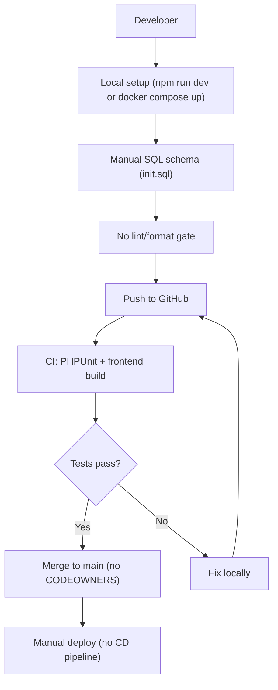
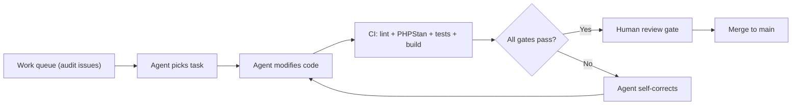
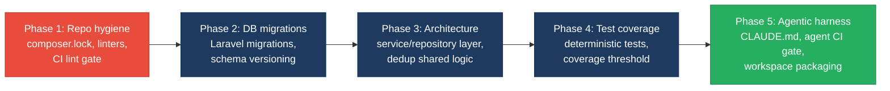

# 8. Technical Debt Analysis

**Objective:** Establish the prerequisites for an Agentic Harness & Marketplace initiative — code repository health, third-party tool usage, AI tool usage, database usage, and development environment readiness.

**Date:** 2026-08-14 12:21:01 IST | **Scope:** `shende-shweta/FSDKC` — PHP 8.3 / Laravel 12 backend, React 19.2 / TypeScript / Vite frontend, Node.js Express dev-API, MariaDB 11 + MongoDB document store, Docker Compose infrastructure, GitHub Actions CI

## Executive Summary

> **Executive Summary**
>
> The FSDKC repository is a monolithic telecom-QA platform with two product modules (Discovery and Connect) running on a PHP/Laravel backend and React/TypeScript frontend, with a Node.js Express dev-API for local development. The most severe debt is in **repository hygiene**: `composer.lock` is not committed (non-reproducible PHP installs), PHPStan is declared as a dev dependency but never runs in CI or locally, and no linter, formatter, or pre-commit hook is configured anywhere in the project — code style enforcement is completely absent. The **development environment** is partially containerized via Docker Compose but the backend `.env.example` hardcodes `secret` as the database password and there is no root-level `.env.example` to unify the three sub-projects. **Database schema is managed via a single raw SQL init file** with no migration framework, no rollback path, and no per-domain ownership boundaries. On the positive side, CI does exist (GitHub Actions runs PHPUnit and frontend build), Docker Compose orchestration is functional, and the AGENTS.md files show early investment in AI-assisted development conventions. The codebase is **not yet ready** for agentic-harness adoption: the missing lock file, absent style enforcement, and manual schema management must be resolved first.

Yes

Top-Level .gitignore Present

1

CI/CD Workflows Found

10 / 10

Third-Party Packages Declared / Wired

Partial

.env.example Present

Overall Codebase Rating — Technical Debt &amp; Agentic Readiness

High Risk

Driven by D1 (Code Repository Health) — missing composer.lock, no code style enforcement, PHPStan declared but never executed — and D4 (Database Usage) — single raw SQL init file with no migration framework or rollback path.

## Readiness Benchmark Ratings

| # | Dimension | Good | Moderate | High Risk | Measured | Rating |
|---|---|---|---|---|---|---|
| D1 | Code Repository Health | all checks pass | 1–2 gaps | 3+ gaps / no CI | `composer.lock` missing; PHPStan declared but never run; no linter/formatter/pre-commit hook; no CODEOWNERS or PR template (4 gaps) | High Risk |
| D2 | Third-Party Tool Usage | mostly wired & current | some unused/unwired | many unused/unmaintained | All 10 declared packages are imported and used in application code; PHPStan is a dev dependency but never invoked (1 unwired) | Moderate |
| D3 | AI Tool / Agentic Readiness | ready | partial | not ready | AGENTS.md present with conventions; `.kiro/` directory scaffolded; two product modules are structurally uniform — but no CI lint gate, no CLAUDE.md, no automated scaffolding scripts | Moderate |
| D4 | Database Usage | sound | some gaps | no constraints / shared flat schema | Single raw SQL init file for all tables; no migration framework; no rollback guards; no per-domain schema ownership; MongoDB collections have no schema validation | High Risk |
| D5 | Development Environment | reproducible | partial | manual / fragile | Docker Compose works; `.env.example` present for backend and dev-api but not at root; no root `.env.example` unifying the three sub-projects; hardcoded `secret` password in `.env.example` and `docker-compose.yml`; no linter/formatter enforced | Moderate |

**No additional readiness gaps beyond the standard dimensions were observed.**

## 8.1 Code Repository

| Check | Finding | Files Inspected | Consequence |
|---|---|---|---|
| `.gitignore` coverage | **Present** — covers `backend/vendor/`, `node_modules/`, `frontend/dist/`, `.env` files, `dev-api/.env`, and `*.log` (8 entries). | `.gitignore:1-8` | Adequate for current stack; prevents committing dependency dirs and env secrets. |
| CI/CD presence | **Present** — single workflow `ci.yml` with two jobs. Backend job: PHP 8.3 setup, MongoDB extension install, `composer install`, PHPUnit. Frontend job: Node 22, `npm ci`, `tsc --noEmit && vite build`. Triggers on push to `main`/`master` and all PRs. **No lint step, no PHPStan step, and no dev-api tests.** | `.github/workflows/ci.yml:1-55` | CI catches test failures and build breaks but cannot verify code style, static types, or coverage thresholds. |
| Branch protection signals | **Missing** — no `CODEOWNERS` file, no PR template, no required-checks config visible in the repo. Only file under `.github/` is `workflows/ci.yml`. | `.github/` directory | Unreviewed code can land on main; no code-ownership assignment for review routing. |
| Lock files committed | **Partial** — `package-lock.json` committed for root, frontend, and dev-api (3 JS lock files). `composer.lock` is **not committed** for the PHP backend. `.gitignore` does not list `composer.lock` — it was simply never generated/committed. | `package-lock.json` (root), `frontend/package-lock.json`, `dev-api/package-lock.json` — present; `backend/composer.lock` — absent | PHP dependency installs are non-reproducible: `composer install` resolves versions dynamically, risking different packages on CI vs. local vs. production. |
| Code style enforcement | **Completely absent** — no ESLint, Prettier, PHP-CS-Fixer, Laravel Pint, EditorConfig, or any linter/formatter config found anywhere. PHPStan is declared in `backend/composer.json:12` (`"phpstan/phpstan": "^2.0"`) but has no `phpstan.neon` config and is never invoked in CI or scripts. No pre-commit hooks (no `.husky/`, `lint-staged`, or `.pre-commit-config*`). | Searched entire repo for `.eslintrc*`, `eslint.config*`, `.prettier*`, `.editorconfig`, `phpcs.xml`, `pint.json`, `.php-cs-fixer*`, `phpstan.neon*`, `.husky/`, `lint-staged*`, `.pre-commit-config*` — all absent | Code style is entirely trust-based; formatting inconsistencies will accumulate across contributors. PHPStan's static-analysis value is wasted since it is never executed. |

## 8.2 Third-Party Tools Usage

### Backend (PHP — `backend/composer.json`)

| Package | Declared | Actually Wired? | Debt |
|---|---|---|---|
| `laravel/framework` ^12.0 | Y | Y — all controllers, models, routing, config, service container use Laravel (13 files import `Illuminate\*` or `App\*` namespaces) | None |
| `mongodb/mongodb` ^2.0 | Y | Y — `app/Services/MongoService.php` creates `MongoDB\Client`, manages 3 collections (`transcripts`, `test_events`, `call_diagnostics`); used by `MongoController` and `RealTimeTestService` | None |
| `phpunit/phpunit` ^11.0 (dev) | Y | Y — `phpunit.xml` configured, 2 test files exist (`HealthTest.php`, `ReachabilityCalculationTest.php`), CI runs `vendor/bin/phpunit` | Tests are trivial — one asserts a hardcoded array, the other uses `random_int()` making it non-deterministic |
| `phpstan/phpstan` ^2.0 (dev) | Y | **N** — no `phpstan.neon` config file, not referenced in any CI step, not in any composer script | Declared but completely unused; occupying dependency space without providing value |

### Frontend (`frontend/package.json`)

| Package | Declared | Actually Wired? | Debt |
|---|---|---|---|
| `react` ^19.2.3 | Y | Y — `main.tsx`, all pages and components import React | None |
| `react-dom` ^19.2.3 | Y | Y — `main.tsx` uses `ReactDOM.createRoot` | None |
| `react-router-dom` ^7.1.0 | Y | Y — `App.tsx` defines routes for Dashboard, Discovery, Connect pages | Routes defined inline in `App.tsx`, no centralized `routes.ts` |
| `@tanstack/react-query` ^5.62.0 | Y | Y — `useQuery`/`useMutation` used in page components for data fetching | None |
| `zustand` ^5.0.2 | Y | Y — `src/store/uiStore.ts` implements UI state store | None |

### Dev-API (`dev-api/package.json`)

| Package | Declared | Actually Wired? | Debt |
|---|---|---|---|
| `express` ^4.21.2 | Y | Y — `src/server.js` creates Express app with full routing | None |
| `cors` ^2.8.5 | Y | Y — `src/server.js:17` `app.use(cors())` with default config | Configured with wildcard `*` origin — allows any origin to call the API |
| `dotenv` ^16.4.7 | Y | Y — `src/seed.js:1` `import 'dotenv/config'` | Also using `node --env-file=.env` flag in npm scripts (redundant loading) |
| `mongodb` ^6.12.0 | Y | Y — `src/mongo.js` creates `MongoClient`, manages connections and collections | None |
| `mongodb-memory-server` ^10.1.4 | Y | Y — `src/mongo.js:34` falls back to in-memory MongoDB when `MONGODB_URI` is absent | None — good DX pattern for zero-config local development |

**Summary:** All 10 runtime and dev packages are genuinely imported and used in application code. PHPStan is the sole declared-but-never-invoked dependency — it ships as a dev dependency but provides zero value without a config file or CI integration.

## 8.3 AI Tool Usage & Agentic Readiness

| Check | Finding | Files Inspected |
|---|---|---|
| AGENTS.md | **Present** — root `AGENTS.md` documents platform stack (Laravel 12, React 19.2, MariaDB + MongoDB), two product modules (Discovery, Connect), and 3 coding conventions. References per-module AGENTS.md files at `backend/app/Modules/*/AGENTS.md` and `frontend/src/modules/*/AGENTS.md`. | `AGENTS.md:1-24` |
| `.kiro/` directory | **Present** — `.kiro/settings/mcp-bundles/.gitignore` exists, indicating Kiro IDE scaffolding was initialized but no MCP bundles are configured yet. | `.kiro/settings/mcp-bundles/.gitignore` |
| CLAUDE.md | **Missing** — no CLAUDE.md found at any level of the repository. | Searched entire repo |
| `.cursor/` directory | **Missing** — no Cursor IDE configuration present. | Searched entire repo |
| GitHub Copilot config | **Missing** — no `.github/copilot*` files. | `.github/` directory |
| Codegen / scaffolding scripts | **Missing** — no `artisan make:*` wrappers, no custom generators, no scaffolding automation. Only scripts are `npm run dev` and `npm run install:all`. | `package.json`, `backend/composer.json`, `frontend/package.json`, `dev-api/package.json` — scripts sections |
| Codebase audit document | **Present** — `docs/CODEBASE_AUDIT_ISSUES.md` is a thorough 14-point audit checklist covering backend architecture debt (business logic in controllers, `extract()` usage, missing service/repository pattern, duplicated code), frontend issues (no centralized API layer, oversized components, missing error boundaries, lifecycle cleanup gaps), security gaps (wildcard CORS, no auth, no validation, no rate limiting), and testing gaps (non-deterministic tests, missing coverage for critical logic, zero frontend tests). | `docs/CODEBASE_AUDIT_ISSUES.md:1-198` |

**Convention violations found:**

<!-- affected-files
search: extract\(
glob: backend/**/*.php
issue: extract() usage violates AGENTS.md convention — "No extract() in PHP"
action: Replace extract() with explicit array destructuring
-->

The AGENTS.md explicitly states "No `extract()` in PHP — use explicit destructuring" but `extract()` appears in 2 production files: `backend/app/Legacy/LegacyDataMapper.php:12,24` and `backend/app/Http/Controllers/Api/LegacyReportController.php:21`. The second case is especially dangerous — `extract($request->all())` on raw request input injects all request parameters as local variables.

**Agentic readiness assessment:** The two product modules (Discovery and Connect) are structurally uniform — each has a controller, model(s), service file, frontend page, and API routes following the same pattern. This uniformity makes them excellent candidates for systematic agent-driven refactoring (e.g. extracting repositories, splitting monolithic page components, deduplicating `buildTree()` logic). However, three prerequisites block safe agent handoff: (1) no CI lint gate means agent-authored code cannot be automatically style-verified; (2) the missing `composer.lock` means agent-authored dependency changes cannot be verified reproducibly; (3) the existing audit document (`CODEBASE_AUDIT_ISSUES.md`) provides a ready-made work queue but there is no automated harness to process it. The AGENTS.md conventions are a strong starting point but need CI enforcement and a `CLAUDE.md` to be actionable for an automated agent.

## 8.4 Database Usage

| Check | Finding | Files Inspected | Consequence |
|---|---|---|---|
| Schema design (MariaDB) | **Adequate** — 5 tables with appropriate column types: `ENUM` constraints for status fields (`pending`/`running`/`completed`/`failed` on `discovery_jobs`; `active`/`paused`/`alert` on `connect_monitors`), `DECIMAL(5,2)` for reachability percentages, `JSON` column for languages, `TIMESTAMP` for audit fields. Foreign keys present on `discovery_nodes.discovery_job_id → discovery_jobs(id) ON DELETE CASCADE` and `connect_check_results.connect_monitor_id → connect_monitors(id) ON DELETE CASCADE`. **Missing:** no secondary indexes beyond PKs and FKs; no index on `discovery_jobs.status` or `connect_monitors.country_code`; self-referencing FK on `discovery_nodes.parent_id` is not enforced. | `docker/mariadb/init.sql:1-63` | Missing secondary indexes will degrade query performance as data grows. The unconstrained `parent_id` allows orphaned tree nodes. |
| Schema design (MongoDB) | **Basic** — 3 collections (`transcripts`, `call_diagnostics`, `test_events`) with compound indexes created in both `docker/mongodb/init.js:63-64` and `dev-api/src/mongo.js:44-46`. No JSON Schema validation rules defined on any collection. | `docker/mongodb/init.js:1-67`, `dev-api/src/mongo.js:44-46` | Without schema validation, any shape of document can be inserted into any collection, risking silent data corruption if a code change alters the document structure. |
| Migration hygiene | **High Risk** — schema is managed via a single `docker/mariadb/init.sql` file using `CREATE TABLE IF NOT EXISTS`. No Laravel migrations exist (`backend/database/migrations/` directory is absent), no versioning, no rollback mechanism. The README explicitly states "Schema is applied via manual SQL init (`docker/mariadb/init.sql`) — matching Klearcom's manual migration practice." The AGENTS.md convention also codifies this: "Schema via manual SQL, not Laravel migrations." | `docker/mariadb/init.sql:1-2`, `README.md:17`, `AGENTS.md:24` | Any schema change requires editing the single init file and recreating the database container from scratch. There is no way to apply incremental changes, roll back a failed migration, or track which schema version is deployed. |
| Data ownership | **Flat** — all 5 MariaDB tables live in a single `klearcom` database with no schema or table-prefix separation between Discovery and Connect modules. MongoDB uses a single `klearcom` database for both modules, differentiated only by a `module` string field on each document. The `users` table exists but has no FK relationship to `discovery_jobs` or `connect_monitors` — there is no data ownership chain. | `docker/mariadb/init.sql:1-63`, `docker/mongodb/init.js:1-39` | Tables and collections are not scoped per domain, which blocks safe extraction into separate services. Any query can access any module's data without constraint. |
| Seed/sample data hygiene | **Adequate** — MariaDB init file includes sample data with `INSERT INTO` statements using synthetic data (`admin@klearcom.local`, `+18005551234`, `Bank IVR Discovery`). MongoDB dev-api seed (`dev-api/src/mongo.js:134-160`) is idempotent: checks existing document count, supports `--force` flag, tags seeded documents with `app: 'klearcom'` for targeted cleanup. No production data or secrets baked into seeds. | `docker/mariadb/init.sql:64-86`, `dev-api/src/seed-data.js:1-119`, `dev-api/src/mongo.js:134-160` | MariaDB seeds are not independently idempotent — they run only as part of Docker container initialization. Re-seeding requires destroying and recreating the volume. |

## 8.5 Development Environment

| Check | Finding | Files Inspected | Consequence |
|---|---|---|---|
| `.env.example` | **Partial** — `backend/.env.example` (14 lines) and `dev-api/.env.example` (2 lines) both exist. No root-level `.env.example` exists to document the unified setup. `backend/.env.example` hardcodes `DB_PASSWORD=secret` which is the same value used in `docker-compose.yml:40` — functional but normalizes weak credentials. `docker-compose.yml` also hardcodes `MYSQL_ROOT_PASSWORD: root` and `MYSQL_PASSWORD: secret` directly in the service definition. | `backend/.env.example:1-14`, `dev-api/.env.example:1-2`, `docker-compose.yml:37-40` | New contributors must discover the two sub-project env files independently. Hardcoded passwords in version control train developers to skip credential management. |
| OS portability | **Good** — setup instructions support both Docker Compose (any OS with Docker) and direct Node.js execution (`npm run dev`). No OS-specific tools required. `entrypoint.sh` uses POSIX-compatible `sh`. | `README.md:19-55`, `package.json:4-6`, `docker/php/entrypoint.sh:1-15` | No portability blockers. |
| Containerization | **Good** — `docker-compose.yml` defines 5 services (nginx, app, mariadb, mongodb, frontend) with `healthcheck` on MariaDB (`healthcheck.sh --connect --innodb_initialized`), named volumes for data persistence (`mariadb_data`, `mongodb_data`), and an entrypoint script that handles first-run composer install and `.env` generation. Frontend Dockerfile uses `node:22-alpine`. PHP Dockerfile installs `pdo_mysql`, `zip`, and `mongodb` extensions. | `docker-compose.yml:1-75`, `docker/php/Dockerfile:1-17`, `frontend/Dockerfile:1-7`, `docker/php/entrypoint.sh:1-15` | Functional container setup for local development. The frontend Dockerfile runs the dev server (not a production build) — acceptable for development but not suitable for production deployment as-is. |
| Code style enforcement | **Completely absent** — no linter, formatter, EditorConfig, or pre-commit hook is configured. PHPStan is declared but has no config file and is never invoked. No ESLint or Prettier for the frontend/dev-api JavaScript/TypeScript code. The frontend has TypeScript with `tsc --noEmit` in the build script, but this only catches type errors — not style or quality issues. | Searched entire repo for all common config filenames (`.eslintrc*`, `eslint.config*`, `.prettier*`, `.editorconfig`, `phpcs.xml`, `pint.json`, `.php-cs-fixer*`, `phpstan.neon*`, `.husky/`, `lint-staged*`, `.pre-commit-config*`) — all absent | Code style is entirely trust-based; formatting inconsistencies will accumulate across contributors. Mixed JSX/TSX file extensions already exist (`LegacyMonitorPoller.jsx` alongside `.tsx` files) with no enforcement. |

## 8.6 Prerequisites for Agentic Harness & Marketplace Readiness

| Prerequisite | Current State | Gap |
|---|---|---|
| Enumerable work queue (clear, listable units of refactor work) | Two product modules (Discovery, Connect) with symmetric structure (controller → model → page → routes); 14-point audit checklist in `docs/CODEBASE_AUDIT_ISSUES.md` provides concrete, actionable work items | Low — audit document already lists concrete work items; module symmetry enables templated refactoring |
| Isolated, verifiable units of work | Modules share the same database with no ownership boundaries; business logic is duplicated across controllers and the dev-api (`buildTree()` exists in 3 places, reachability formula in 3 places); page components are monolithic (176–222 lines) | High — no service/repository layer isolation; changes to shared KPI logic or `buildTree()` affect both modules simultaneously |
| CI gate to accept agent-authored output | GitHub Actions runs PHPUnit and frontend build; no lint step, no PHPStan step, no dev-api tests, no coverage gate, no required-checks enforcement | Critical — CI can detect build failures and test regressions but cannot verify code style, static analysis, or coverage thresholds for agent-authored changes |
| Repo hygiene for automation (clean checkout, no secrets) | `.gitignore` covers deps and env files; `.env` files are not committed; however `composer.lock` is missing (non-reproducible installs) and `docker-compose.yml` contains hardcoded `secret`/`root` passwords in plain text | High — non-reproducible PHP installs break deterministic CI; inline credentials in version control |
| Marketplace packaging readiness | Monorepo with 3 sub-projects (backend, frontend, dev-api) and Docker Compose; no workspace protocol (npm/pnpm workspaces), no shared type definitions, no API contract specifications (OpenAPI/Swagger), no versioning strategy | Medium — functional but not packageable as independent marketplace modules without workspace restructuring and API contracts |

## 8.7 Diagrams

### Current dev / delivery flow

### Agentic harness readiness target

### Improvement roadmap

## 8.8 Actions Required

| Gap | Action | Rating | Priority |
|---|---|---|---|
| `composer.lock` not committed | Run `composer install` in the backend directory and commit the generated `composer.lock`; add `composer.lock` to CI cache key for reproducible installs | High Risk | Critical |
| No code style enforcement (lint/format) | Add ESLint + Prettier for frontend/dev-api, Laravel Pint or PHP-CS-Fixer for backend; create `.editorconfig` for baseline indent/whitespace rules; add lint step to `.github/workflows/ci.yml` before test/build steps | High Risk | Critical |
| PHPStan declared but never run | Create `backend/phpstan.neon` with level 5+ baseline; add `vendor/bin/phpstan analyse` step to CI workflow after PHPUnit; add a composer script `"analyse": "phpstan analyse"` | High Risk | Critical |
| No migration framework — single raw SQL init | Introduce Laravel migrations (`php artisan make:migration`); convert `docker/mariadb/init.sql` DDL into versioned migration files; add `php artisan migrate` to CI backend job and Docker `entrypoint.sh` | High Risk | Critical |
| No CODEOWNERS or PR template | Add `.github/CODEOWNERS` mapping `backend/` and `frontend/` to respective team leads; add `.github/pull_request_template.md` with review checklist | High Risk | High |
| No rollback guards on schema changes | Ensure each Laravel migration has a `down()` method; add a CI step that runs `migrate` then `migrate:rollback` to verify reversibility | High Risk | High |
| Hardcoded passwords in docker-compose.yml and .env.example | Replace inline `MYSQL_PASSWORD: secret` and `MYSQL_ROOT_PASSWORD: root` in `docker-compose.yml` with `env_file` directive pointing to `.env`; use placeholder values in `.env.example` (e.g. `DB_PASSWORD=changeme`) | Moderate | High |
| CORS wildcard on both backend and dev-api | Restrict `allowed_origins` in `backend/config/cors.php:6` from `['*']` to specific frontend origins; replace `app.use(cors())` in `dev-api/src/server.js:17` with origin-specific config | Moderate | High |
| Flat data ownership (no per-domain schema boundaries) | Document table ownership per module (`discovery_jobs` + `discovery_nodes` → Discovery; `connect_monitors` + `connect_check_results` → Connect); consider separate MongoDB databases per module; add FK from `discovery_nodes.parent_id` to `discovery_nodes.id` | High Risk | Medium |
| MongoDB collections lack schema validation | Add JSON Schema validators to `transcripts`, `test_events`, and `call_diagnostics` collections via `db.createCollection()` with `validator` option in `docker/mongodb/init.js` | High Risk | Medium |
| No root-level .env.example | Create a root `.env.example` that documents all required variables across the three sub-projects (backend, frontend, dev-api) with placeholder values | Moderate | Medium |
| No CLAUDE.md for agentic harness | Create `CLAUDE.md` at repo root documenting project conventions, build/test commands, and agent guardrails; extend existing AGENTS.md with CI-verifiable rules | Moderate | Medium |
| CI does not run dev-api tests | Add a `dev-api` job to `ci.yml` that installs dependencies and runs test suite (create basic API smoke tests first since none currently exist) | Moderate | Medium |

## 8.9 Expected Outcomes

- **Reproducible builds:** Committing `composer.lock` and enforcing lock-file integrity in CI ensures every environment installs identical dependency versions, eliminating "works on my machine" failures.
- **Automated style enforcement:** Configuring linters/formatters with CI gates eliminates code-style drift and enables agents to produce style-compliant output without human review overhead.
- **Versioned, reversible schema changes:** Migrating from raw SQL init to Laravel migrations provides an auditable history of schema changes with rollback capability, a prerequisite for safe agent-driven database modifications.
- **CI trust for agent-authored changes:** Adding lint, PHPStan, and coverage gates to CI gives the harness a reliable pass/fail signal to accept or reject agent output automatically.
- **Foundation for agentic harness adoption:** With reproducible installs, enforced style, versioned schema, and comprehensive CI gates, the codebase becomes safe for automated agents to propose, verify, and land changes under human review.
