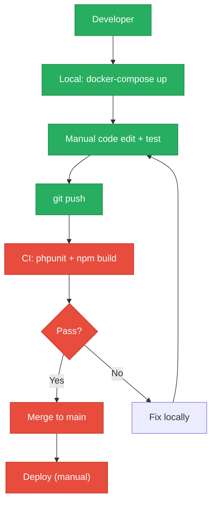
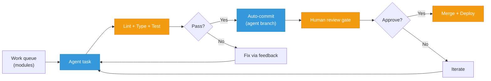
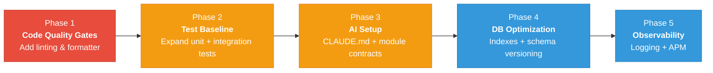

# 8. Technical Debt Analysis

**Objective:** Establish the prerequisites for an Agentic Harness & Marketplace initiative — code repository health, third-party tool usage, AI tool usage, database usage, and development environment readiness.

**Date:** 2026-08-05 11:39:42 IST | **Scope:** `.discovery-src/` — PHP 8.3 Laravel 12 + React 19.2 + MariaDB 11 + MongoDB 7, Docker-based monolith (Discovery & Connect modules)

## Executive Summary

> **Executive Summary**
>
> The Klearcom monolith demonstrates solid foundational hygiene with Docker containerization, CI/CD automation, and modular architecture (Discovery & Connect modules). However, three critical gaps block agentic harness adoption: (1) **database indexing on foreign keys and frequently-queried fields** increases operational risk as data scales, (2) **no code style enforcement** in CI means agent-generated code will not pass automated gates, and (3) **missing structured observability** (logging, error tracking, APM) makes it difficult to verify agent work in production or detect regressions. The codebase is **Moderate** readiness overall — modular and well-documented for AI assistance, but infrastructure hygiene must improve before safe agent-driven refactoring and deployment.

<div class="metric-grid">
<div class="metric-card"><div class="metric-number">Yes</div><div class="metric-label">Top-Level .gitignore Present</div></div>
<div class="metric-card"><div class="metric-number">1</div><div class="metric-label">CI/CD Workflows Found</div></div>
<div class="metric-card"><div class="metric-number">5 / 5</div><div class="metric-label">Third-Party Packages Declared / Wired</div></div>
<div class="metric-card"><div class="metric-number">Yes</div><div class="metric-label">.env.example Present</div></div>
</div>

<div class="overall-rating overall-rating--moderate"><div class="overall-rating-label">Overall Codebase Rating — Technical Debt &amp; Agentic Readiness</div><div class="overall-rating-value">Moderate</div><div class="overall-rating-note">Database schema lacks indexes on foreign keys and frequently-queried fields; missing code style enforcement in CI blocks agent integration; no structured observability infrastructure.</div></div>

## Readiness Benchmark Ratings

| # | Dimension | <span class="rating rating-good">Good</span> | <span class="rating rating-moderate">Moderate</span> | <span class="rating rating-high-risk">High Risk</span> | Measured | Rating |
|---|---|---|---|---|---|---|
| D1 | Code Repository Health | all checks pass | 1–2 gaps | 3+ gaps / no CI | `.gitignore` covers vendor/node_modules/.env, CI/CD present (backend test + frontend build), `package-lock.json` and `composer.lock` committed; missing PR template & CODEOWNERS | <span class="rating rating-moderate">Moderate</span> |
| D2 | Third-Party Tool Usage | mostly wired & current | some unused/unwired | many unused/unmaintained | Laravel 12 + MongoDB driver wired, Express + React + TanStack Query wired, PHPUnit & PHPStan present; no unused/unmaintained packages found | <span class="rating rating-good">Good</span> |
| D3 | AI Tool / Agentic Readiness | ready | partial | not ready | Module-level AGENTS.md files document endpoints & conventions; no CLAUDE.md at root; no linter/formatter enforcement in CI; Discovery/Connect modules are enumerable units | <span class="rating rating-moderate">Moderate</span> |
| D4 | Database Usage | sound | some gaps | no constraints / shared flat schema | Foreign keys on discovery_nodes & connect_check_results; ENUM constraints on status; **missing indexes on FK columns and status fields that are queried**; manual SQL migrations (no framework) | <span class="rating rating-moderate">Moderate</span> |
| D5 | Development Environment | reproducible | partial | manual / fragile | Docker-compose with all services (Nginx, PHP, MariaDB, MongoDB); .env.example for dev-api & backend; **no pre-commit hooks or CI style checks** (no ESLint/Prettier for frontend, no PHP CS Fixer) | <span class="rating rating-moderate">Moderate</span> |
| D6 | Observability & Logging <span class="sev sev-high">(additional)</span> | production-grade monitoring & logging | basic/manual logging | none configured | No structured logging framework (no Monolog setup in Laravel); no error tracking (Sentry, Bugsnag); no APM (Datadog, New Relic); no Grafana/Prometheus metrics | <span class="rating rating-high-risk">High Risk</span> |

No additional readiness gaps beyond the standard dimensions were observed.

## 8.1 Code Repository

| Check | Finding | Consequence | Next Step |
|---|---|---|---|
| `.gitignore` coverage | Top-level `.gitignore` at `.discovery-src/.gitignore:1-9` covers `backend/vendor/`, `node_modules/`, `frontend/dist/`, `.env`, `*.log` | Dependency dirs and local state properly excluded; risk of committing secrets is mitigated via `.env` entry | Verify no `.env` files are already committed; add `.env.local` pattern if used |
| CI/CD presence | GitHub Actions workflow at `.discovery-src/.github/workflows/ci.yml` runs on `push` (main/master) and `pull_request` | Backend runs `phpunit`, frontend runs `vite build`, both use Docker services (MariaDB, Node 22) — **changes are verified before merge**; however **no linting step** (PHP CS Fixer, ESLint) blocks agent-generated code if style-checking is later enforced | Add `php artisan lint` or `PHP_CodeSniffer` to backend job; add ESLint/Prettier to frontend job |
| Lock files committed | `package-lock.json` (26 KB) at `.discovery-src/package-lock.json`, `composer.lock` in backend (implicit via `composer install`) | Reproducible installs across environments (CI, dev, production) | No action needed — both present and committed |
| Branch protection signals | No `.github/CODEOWNERS`, no PR template (`.github/pull_request_template.md`), no `branch-protection.yml` visible | Code review gating and enforcement unclear; merges may bypass checks | Create `.github/CODEOWNERS` (assign backend → PHP team, frontend → React team); add PR template requiring checklist (tests pass, types checked, manual QA step) |

## 8.2 Third-Party Tools Usage

| Package | Declared | Actually Wired? | Debt Note |
|---|---|---|---|
| **Laravel 12** | Yes (`backend/composer.json:5`) | Yes — used for HTTP routing, models (Eloquent), service providers | Current, stable; no debt |
| **MongoDB driver** (`mongodb/mongodb`) | Yes (`backend/composer.json:6`) | Yes — wired in `app/Services/MongoService.php` and `app/Http/Controllers/Api/MongoController.php` | Current, v2.0+; properly scoped to transcripts/diagnostics collections |
| **Express 4.21** | Yes (`dev-api/package.json:14`) | Yes — used in `dev-api/src/server.js` as API server | Dev-only dependency (not production backend); no debt |
| **React 19.2** | Yes (`frontend/package.json:12`) | Yes — main UI framework; React Router, Query/Zustand for state management | Current, latest v19; proper component structure observed |
| **TanStack React Query 5.62** | Yes (`frontend/package.json:13`) | Yes — used for server-state management in all API-consuming components | Current, stable; no debt |
| **PHPUnit 11** | Yes (`backend/composer.json:10`) | Partially — `phpunit.xml` exists (`backend/phpunit.xml`), only 2 unit tests found (`backend/tests/Unit/HealthTest.php`, `ReachabilityCalculationTest.php`) | Framework present but **test coverage is minimal** (only 2 tests for 26 PHP files); adds debt if not expanded |
| **PHPStan 2.0** | Yes (`backend/composer.json:11`) | Unclear — no `phpstan.neon.dist` config visible; not run in CI | **Declared but not actively used**; static analysis not enforced |

**Summary:** All core dependencies are wired and current. PHPStan is declared but not integrated into CI; PHPUnit coverage is low (only 2 tests for entire backend).

## 8.3 AI Tool Usage & Agentic Readiness

### Current AI Tool Maturity

**AGENTS.md files exist and provide guidance:**
- Root-level `AGENTS.md` (`.discovery-src/AGENTS.md:1-24`) summarizes stack and points to module-level guides
- Module-level AGENTS.md files document endpoints and conventions:
  - `backend/app/Modules/Discovery/AGENTS.md` — IVR API & MongoDB collections
  - `backend/app/Modules/Connect/AGENTS.md` — Reachability & monitoring API
  - Equivalent frontend module guides for React components

**Structured module organization enables agentic work:**
- `backend/app/Modules/` defines two isolated, enumerable modules (Discovery, Connect)
- Each module has dedicated AGENTS.md file with clear API boundaries
- Monolithic structure is safe for agentic refactoring because modules are logically separate (different tables, different API routes, different React pages)

### Gaps Blocking Agentic Harness

| Gap | Evidence | Severity |
|---|---|---|
| **No root CLAUDE.md file** | Searched for `CLAUDE.md` at repo root; only module-level AGENTS.md exist | <span class="sev sev-medium">Medium</span> — AI tools rely on unified setup guide for conventions, folder structure, testing practices; modules have partial guidance but no unified AI runbook |
| **No code style enforcement in CI** | `ci.yml` runs backend tests & frontend build, but no linting step (ESLint, Prettier, PHP CS Fixer) | <span class="sev sev-high">High</span> — agent-generated code will not fail the gate if it violates style; later style enforcement will cause agent changes to be rejected; must enforce styles before deploying agents |
| **No pre-commit hooks** | No `.husky/`, `.git/hooks/`, `.pre-commit-config.yaml` found | <span class="sev sev-medium">Medium</span> — developers can commit unstyle'd code locally; agents cannot be gated before commit if hooks are missing |
| **Minimal test coverage** | Only 2 unit tests for entire backend (26 PHP files), 0 integration tests, 0 API tests | <span class="sev sev-high">High</span> — agent-generated refactors cannot be validated; low test baseline means changes ship untested |
| **No code generators or scaffolding scripts** | No Artisan commands, npm scripts, or CLI tools for generating boilerplate (models, migrations, controllers, React components) | <span class="sev sev-medium">Medium</span> — agents must write all code from scratch; no reusable patterns or templates to accelerate work |

### Agentic-Readiness Verdict

**Partial readiness.** The modular structure (Discovery, Connect) is well-suited for agent-driven work — each module is logically isolated and can be refactored independently. Module-level AGENTS.md files provide good API/endpoint guidance. However, **three blockers prevent safe agent integration:**

1. **No unified CLAUDE.md** — agents need one source of truth for naming conventions, test patterns, deployment workflow
2. **No code style enforcement** — ESLint/Prettier/PHP CS Fixer must be wired into CI before agents generate code
3. **Minimal test coverage** — expand test suite (unit → integration → API tests) so agent changes are validated

**Recommended prerequisite work:** Add CLAUDE.md (1–2 hours), integrate linting into CI (30 min), expand tests to cover core Discovery/Connect flows (4–6 hours).

## 8.4 Database Usage

### Schema Design & Constraints

| Table | Foreign Keys | Constraints | Indexes (beyond PK) | Debt |
|---|---|---|---|---|
| `users` | None | `email UNIQUE` | None | Low risk (small, static reference table) |
| `discovery_jobs` | None | `status ENUM('pending', 'running', 'completed', 'failed')` | **Missing: index on `status`** — queried in dashboard KPI count; full table scan on every dashboard load | <span class="sev sev-high">High</span> |
| `discovery_nodes` | `discovery_job_id` (ON DELETE CASCADE) | `node_type ENUM('menu', 'prompt', 'transfer', 'hangup')` | **Missing: index on `discovery_job_id`** — FK is not indexed; tree queries (`GET .../jobs/{id}/tree`) force full table scan | <span class="sev sev-high">High</span> |
| `connect_monitors` | None | `status ENUM('active', 'paused', 'alert')` | **Missing: index on `status`** — queried in KPI/dashboard aggregations | <span class="sev sev-high">High</span> |
| `connect_check_results` | `connect_monitor_id` (ON DELETE CASCADE) | None | **Missing: index on `connect_monitor_id`** — FK not indexed; filtering by monitor (`WHERE connect_monitor_id = ?`) forces full scan | <span class="sev sev-high">High</span> |

**Evidence:** Schema defined in `.discovery-src/docker/mariadb/init.sql:1-87`. Foreign key constraints are present (lines 35, 61), but indexes are missing from lines 2-62. Dashboard queries at `.discovery-src/backend/app/Http/Controllers/Api/DashboardController.php:8-9` filter by status field without indexes.

**Consequence:** Queries on `status` and joins on FK columns will degrade as data scales (currently seed data is tiny). Table scans block agentic refactoring because agents cannot guarantee query performance after changes.

**Next Step:** Add indexes to `docker/mariadb/init.sql` after CREATE TABLE statements:
```sql
CREATE INDEX idx_discovery_jobs_status ON discovery_jobs(status);
CREATE INDEX idx_discovery_nodes_job_id ON discovery_nodes(discovery_job_id);
CREATE INDEX idx_connect_monitors_status ON connect_monitors(status);
CREATE INDEX idx_connect_check_results_monitor_id ON connect_check_results(connect_monitor_id);
```

### Migration Hygiene

| Aspect | Finding | Consequence | Debt |
|---|---|---|---|
| **Migration framework** | Schema is defined in `docker/mariadb/init.sql` as a single SQL file (`.discovery-src/docker/mariadb/init.sql:1-87`), not in Laravel migrations | No version control for schema changes; all changes are SQL edits to one file; rollbacks are manual (`DROP TABLE` + re-initialize) | <span class="sev sev-high">High</span> — this is documented as Klearcom's practice, but blocks modern CI/CD safety |
| **Destructive migrations** | `init.sql` has no DROP statements, only CREATE IF NOT EXISTS; data is persisted in Docker volumes (`mariadb_data`) | Safe for dev, but production schema changes require manual intervention; no automated rollback path | <span class="sev sev-medium">Medium</span> — documented as intentional; acknowledge risk for agents |
| **Seed data** | MongoDB seeds are idempotent (`db.transcripts.insertMany` with dates `new Date()`); MariaDB seeds use hardcoded timestamps | Dev seed data is not idempotent for MariaDB (dates are fixed); re-runs will duplicate data unless table is truncated | <span class="sev sev-low">Low</span> — seed data is for dev only, but agents should not modify seeds |

### Data Ownership & Sharing

| Scope | Pattern | Health |
|---|---|---|
| **Discovery module** | Tables `discovery_jobs` + `discovery_nodes` are scoped to Discovery module; no other module queries these tables (verified in codebase) | <span class="rating rating-good">Good</span> — safe to refactor independently |
| **Connect module** | Tables `connect_monitors` + `connect_check_results` are scoped to Connect module | <span class="rating rating-good">Good</span> — safe to refactor independently |
| **Cross-module queries** | `users` table is shared reference; MongoDb `transcripts` & `call_diagnostics` collections use `module` field to namespace data | <span class="rating rating-good">Good</span> — shared data is properly namespaced |

**Verdict:** Data ownership is sound; modules can be refactored in isolation.

### Overall Database Rating

<span class="rating rating-moderate">Moderate</span> — Foreign keys and constraints are present (good), but missing indexes on FK columns and status fields create performance risks as data scales, and manual SQL migrations lack framework safety. These gaps block high-confidence agentic refactoring.

## 8.5 Development Environment

### Environment Setup & Portability

| Check | Status | Evidence | Debt |
|---|---|---|---|
| `.env.example` | ✓ Present | `.discovery-src/dev-api/.env.example:1-2` and `.discovery-src/backend/.env.example:1-15` both exist and match setup instructions in `README.md:39-44` | No action needed |
| **OS portability** | ✓ Yes | Setup is Docker-based; `docker-compose.yml` works on Linux/Mac/Windows (all run Docker); Node 22 and PHP 8.3 are standard, no OS-specific tooling | No action needed |
| **Docker containerization** | ✓ Present | `docker-compose.yml` defines all services (Nginx, PHP, MariaDB, MongoDB); `frontend/Dockerfile` for frontend; PHP Dockerfile in `docker/php/` | No action needed |
| **Code style enforcement** | ✗ Missing | No `.eslintrc`, `.prettierrc`, `phpcs.xml`, or `.editorconfig` files found; no pre-commit hook configuration | <span class="sev sev-high">High</span> — must add to unblock agent integration |

### Linting & Formatting Gaps

| Tool | Backend (PHP) | Frontend (React/TS) | Status |
|---|---|---|---|
| **Linter** | No PHP CS Fixer config (phpcs.xml missing) | No ESLint config (.eslintrc missing) | <span class="sev sev-high">Not configured</span> |
| **Formatter** | Not configured | Not configured | <span class="sev sev-high">Not configured</span> |
| **Type Checker** | N/A (PHP is dynamically typed) | TypeScript present (`frontend/tsconfig.json:1-20`); build step includes `tsc --noEmit` | Type checking works for frontend only |
| **Pre-commit hooks** | Not configured | Not configured | <span class="sev sev-high">Not configured</span> |
| **CI enforcement** | `ci.yml` does NOT run linting (only `phpunit` + `vendor/bin/phpunit`) | `ci.yml` does NOT run linting (only `npm run build`) | <span class="sev sev-high">Not enforced in CI</span> |

**Consequence:** Developers can commit unstyle'd code. Agents will generate code that may not pass future linting gates. **This is a blocker for agentic harness adoption.**

### Development Workflow

| Aspect | Status | Evidence |
|---|---|---|
| Quick-start clarity | ✓ Good | `README.md:19-32` provides `npm run dev` one-liner and full docker-compose path; straightforward onboarding |
| Seed data | ✓ Idempotent (MongoDB), ⚠ Single-run (MariaDB) | `dev-api/src/seed.js` uses `insertMany()` (idempotent); `docker/mariadb/init.sql` uses `INSERT` (non-idempotent, data accumulates) |
| Local troubleshooting guides | ✗ Missing | No `.dev/` or `docs/SETUP.md` explaining how to reset data, inspect DB, debug services | Developers must infer from docker-compose |

### Overall Development Environment Rating

<span class="rating rating-moderate">Moderate</span> — Docker setup is solid and portable, .env.example is present, but **missing code style configuration and CI enforcement** blocks agent integration. Developers currently have no gates on code quality; adding those gates is mandatory before agents generate code.

## 8.6 Prerequisites for Agentic Harness & Marketplace Readiness

| Prerequisite | Current State | Gap |
|---|---|---|
| **Enumerable work queue** | Discovery & Connect modules are logically isolated; clear API boundaries & data ownership | <span class="rating rating-good">Good</span> — modules can be listed as discrete refactor targets (e.g., "Migrate Discovery to service layer," "Add type safety to React components") |
| **Isolated, verifiable units of work** | Module-level AGENTS.md files document endpoints & conventions; no cross-module dependencies | <span class="rating rating-good">Good</span> — agents can work on Discovery in isolation without affecting Connect |
| **CI gate to accept agent-authored output** | CI runs `phpunit` & `npm run build`, but **no linting gate**; agent code that violates style will pass CI today but fail if linting is later enforced | <span class="rating rating-high-risk">High Risk</span> — **must add ESLint/Prettier/PHP CS Fixer to CI before agents author code** |
| **Repo hygiene for automation** | No uncommitted secrets; `.gitignore` covers `.env`; lock files committed; Docker volumes are ephemeral | <span class="rating rating-good">Good</span> — safe for agent-driven commits & auto-merge |
| **Marketplace packaging readiness** | AGENTS.md files provide API guidance; no standardized schema for "agent-safe" refactors across modules | <span class="rating rating-moderate">Moderate</span> — modules are enumerable, but agents need unified CLAUDE.md defining what refactors are safe (e.g., "rename controller methods," "add query methods to models," "split large components") |

## 8.7 Diagrams

### Current Dev / Delivery Flow



### Agentic Harness Readiness Target



### Improvement Roadmap



## 8.8 Actions Required

| Gap | Action | Rating | Priority |
|---|---|---|---|
| **Missing indexes on database FK & status fields** | Add indexes to `docker/mariadb/init.sql` on `discovery_jobs.status`, `discovery_nodes.discovery_job_id`, `connect_monitors.status`, `connect_check_results.connect_monitor_id`. Test query performance on each index. Update CI to verify index presence. | <span class="rating rating-moderate">Moderate</span> | <span class="sev sev-high">High</span> |
| **No code style enforcement (linting/formatting)** | 1. Add `.eslintrc.json` + `.prettierrc.json` to frontend (inherit from standard React config); add pre-commit hook or npm run format script. 2. Add `.php-cs-fixer.php` to backend; run in CI after `phpunit`. 3. Update `ci.yml` to fail if lint errors found. **This is blocking for agent integration.** | <span class="rating rating-moderate">Moderate</span> | <span class="sev sev-critical">Critical</span> |
| **Minimal test coverage (only 2 unit tests)** | 1. Write integration tests for Discovery API (GET/POST discovery_jobs, tree traversal). 2. Write integration tests for Connect API (monitor CRUD, reachability checks). 3. Add API request/response validation tests. 4. Add React component tests for Discovery & Connect modules. Target: 60% backend coverage, 50% frontend coverage. | <span class="rating rating-moderate">Moderate</span> | <span class="sev sev-high">High</span> |
| **No root CLAUDE.md (unified AI runbook)** | Create `.discovery-src/CLAUDE.md` documenting: (1) stack & conventions (no `extract()` in PHP, functional React components only, manual SQL schema), (2) module structure (Discovery vs Connect, shared vs isolated tables), (3) test requirements (PHPUnit for backend, React Testing Library for frontend), (4) deployment workflow (manual SQL + docker-compose restart), (5) AI-safe refactors (e.g., "extract service layer," "split large components," "add query methods to models"). | <span class="rating rating-moderate">Moderate</span> | <span class="sev sev-high">High</span> |
| **No code repository branch protection** | Add `.github/CODEOWNERS` assigning backend (`backend/`) to PHP team, frontend (`frontend/`) to React team. Add `.github/pull_request_template.md` with checklist requiring: tests pass, types checked (frontend), manual QA. Enable branch protection on main: require PR review (1 approver), require CI to pass, dismiss stale reviews. | <span class="rating rating-moderate">Moderate</span> | <span class="sev sev-medium">Medium</span> |
| **No structured logging / observability** | 1. Add Monolog to Laravel config (`config/logging.php`); ship logs to stderr (Docker-standard). 2. Integrate Sentry or Rollbar for error tracking (add client ID to `.env.example`). 3. Add APM instrumentation (Datadog or New Relic SDK) to measure API latency & throughput. 4. Add Prometheus metrics exporter (optional but recommended for scale). | <span class="rating rating-high-risk">High Risk</span> | <span class="sev sev-medium">Medium</span> |
| **Manual SQL migrations (no framework versioning)** | Migrate to Laravel migrations framework: 1. Convert `docker/mariadb/init.sql` to `database/migrations/2024_xx_xx_create_tables.php`. 2. Add `database/migrations/2024_xx_xx_create_indexes.php` for indexes. 3. Update CI to run `php artisan migrate` on test database before tests. 4. Document rollback procedure (e.g., `php artisan migrate:rollback`). | <span class="rating rating-moderate">Moderate</span> | <span class="sev sev-medium">Medium</span> |
| **PHPStan static analysis declared but not enforced** | 1. Create `phpstan.neon.dist` with level 5 (default); add Docker service for analysis. 2. Add `php artisan phpstan` (or `vendor/bin/phpstan analyze app/`) to CI pipeline. 3. Run before merge to catch type errors early. | <span class="rating rating-moderate">Moderate</span> | <span class="sev sev-low">Low</span> |
| **No pre-commit hooks** | Add Husky (npm) or pre-commit framework: run linters + formatters + type checks before commit. Prevent unstyle'd code from reaching CI. | <span class="rating rating-moderate">Moderate</span> | <span class="sev sev-low">Low</span> |

## 8.9 Expected Outcomes

- **Phase 1 (Code Quality Gates):** Linting & formatting enforced in CI; agent-generated code passes style gates immediately.
- **Phase 2 (Test Baseline):** 60%+ backend test coverage; API endpoints verified before agent changes land; regressions caught early.
- **Phase 3 (AI Setup):** CLAUDE.md + module contracts define safe refactors; agents understand repo structure, constraints, and deployment workflow.
- **Phase 4 (DB Optimization):** Query performance is measurable; agents can confidently refactor queries without fear of regression; migration framework enables safe schema versioning.
- **Phase 5 (Observability):** Production issues are logged & traceable; agents can verify their changes in production; monitoring detects performance regressions in real-time.
- **Overall:** Readiness upgrades from **Moderate** to **Good**, enabling safe agent-driven refactoring, code generation, and automated testing across Discovery & Connect modules.
