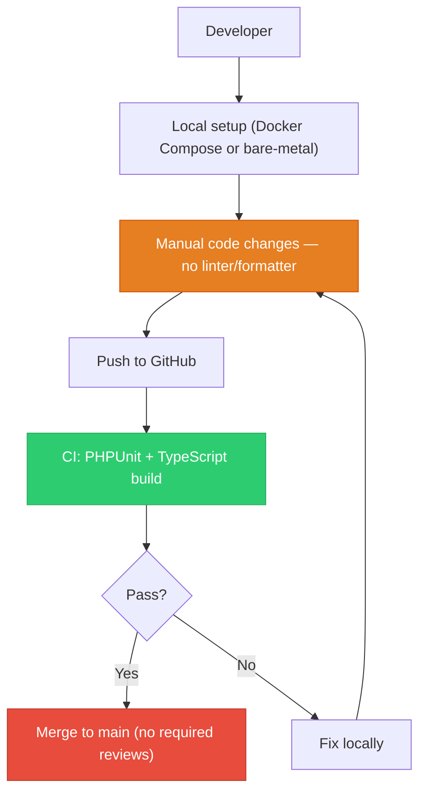
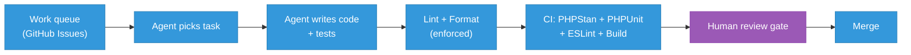
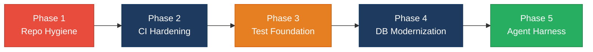

# 8. Technical Debt Analysis

**Objective:** Establish the prerequisites for an Agentic Harness & Marketplace initiative — code repository health, third-party tool usage, AI tool usage, database usage, and development environment readiness.

**Date:** 2026-08-18 18:58:33 IST | **Scope:** `shende-shweta/FSDKC` — PHP 8.3 / Laravel 12 backend, React 19.2 / TypeScript / Vite frontend, Node.js 22 Express dev-API, MariaDB 11, MongoDB 7, Docker Compose, GitHub Actions CI

## Executive Summary

> **Executive Summary**
>
> The Klearcom monolithic platform has a sound foundational architecture — Docker Compose orchestration, a GitHub Actions CI pipeline, committed lock files for Node.js packages, and `.env.example` files for both the backend and dev-API. However, several structural gaps collectively lower its agentic-harness readiness. The backend `composer.lock` is not committed, eliminating reproducible PHP dependency installs. No linter, formatter, or pre-commit hook is configured or enforced anywhere in the stack, so code style drifts immediately. Branch-protection artifacts (CODEOWNERS, PR templates, required-checks config) are entirely absent. PHPStan is declared as a dev-dependency but is never wired into CI or any local command. The database uses a single monolithic `init.sql` instead of versioned migrations, and the MariaDB schema has no secondary indexes beyond primary keys. The codebase does ship AI-assistance guides (`AGENTS.md` at root and per-module), positioning it ahead of most repositories for agentic readiness, but the lack of enforced style and a missing `composer.lock` mean agent-authored changes cannot be deterministically verified. The overall verdict is **Moderate** — no single dimension is catastrophically broken, but the cumulative gaps across repository health, development environment, and database hygiene block safe, automated agent workflows today.

Yes

Top-Level .gitignore Present

1

CI/CD Workflows Found

9 / 7

Third-Party Packages Declared / Wired

Partial

.env.example Present

Overall Codebase Rating — Technical Debt &amp; Agentic Readiness

Moderate

All five dimensions rated Moderate — the breadth of 1–2 gaps per dimension (missing composer.lock, no style enforcement, no migration framework, partial .env.example coverage) prevents any dimension from reaching Good, but none crosses the High Risk threshold individually.

## Readiness Benchmark Ratings

| # | Dimension | Good | Moderate | High Risk | Measured | Rating |
|---|---|---|---|---|---|---|
| D1 | Code Repository Health | all checks pass | 1–2 gaps | 3+ gaps / no CI | CI present and runs tests + build; `.gitignore` covers deps and env; Node lock files committed. Gaps: `composer.lock` missing; no CODEOWNERS / PR template. (2 gaps) | Moderate |
| D2 | Third-Party Tool Usage | mostly wired & current | some unused/unwired | many unused/unmaintained | 7 of 9 declared packages are actively wired in application code. PHPStan and `dotenv` (dev-api) are declared but not wired into any enforced workflow. | Moderate |
| D3 | AI Tool / Agentic Readiness | ready | partial | not ready | Root and per-module `AGENTS.md` files exist. `.kiro/` directory present (mostly empty). Two product modules (Discovery, Connect) form structurally uniform, enumerable units. Missing: enforced style and deterministic PHP builds block safe agent output verification. | Moderate |
| D4 | Database Usage | sound | some gaps | no constraints / shared flat schema | Foreign keys present on child tables. Schema uses ENUM constraints and NOT NULL. Gaps: no secondary indexes on MariaDB tables; single monolithic `init.sql` instead of versioned migrations; MongoDB collections lack schema validation. | Moderate |
| D5 | Development Environment | reproducible | partial | manual / fragile | Docker Compose present with health checks. `backend/.env.example` and `dev-api/.env.example` present. Gaps: no root or frontend `.env.example`; no linter/formatter/pre-commit hook configured anywhere; `composer.lock` not committed. | Moderate |

**No additional readiness gaps beyond the standard dimensions were observed.**

## 8.1 Code Repository

| Check | Finding | Evidence |
|---|---|---|
| `.gitignore` coverage | **Present and adequate.** Covers `backend/vendor/`, `backend/.env`, `node_modules/`, `frontend/dist/`, `dev-api/.env`, `*.log`, and root `.env` — 8 entries spanning all three sub-projects. Prevents committing dependency dirs, build output, and secret files. | `.gitignore:1-8` |
| CI/CD presence | **Present.** Single workflow `.github/workflows/ci.yml` triggers on push to `main`/`master` and all PRs. Backend job: sets up PHP 8.3, installs MongoDB extension via PECL, runs `composer install`, copies `.env.example`, generates app key, and executes `vendor/bin/phpunit` against a MariaDB 11 service container. Frontend job: sets up Node 22, runs `npm ci` (with `npm install` fallback), and runs `npm run build` which executes `tsc --noEmit && vite build`. **No lint step, no PHPStan step, and no dev-api tests are included.** | `.github/workflows/ci.yml:1-42` |
| Branch protection signals | **Absent.** No `CODEOWNERS` file, no `.github/PULL_REQUEST_TEMPLATE.md`, no `.github/branch-protection*` or `ruleset` config visible in the repository. The `.github/` directory contains only the `workflows/` subdirectory. This means unreviewed code can land on `main` without a required review or passing status check. | `.github/` directory contains only `workflows/ci.yml` |
| Lock files committed | **Partial.** Three Node.js lock files committed: `package-lock.json` at root (11 KB), `frontend/package-lock.json` (65 KB), and `dev-api/package-lock.json` (54 KB). `composer.lock` is **not committed** for the Laravel backend — `.gitignore` does not exclude it, so it was simply never generated or committed. This means `composer install` in CI resolves dependencies at whatever version is latest, producing non-reproducible builds that may differ from the developer's local environment. | `ls` confirms `backend/composer.lock` absent; three `package-lock.json` files present |

## 8.2 Third-Party Tools Usage

### Backend (PHP / Laravel 12) — `backend/composer.json`

| Package | Declared | Actually Wired? | Debt |
|---|---|---|---|
| `laravel/framework` ^12.0 | Y | Y — routing, Eloquent ORM, middleware, CORS, queue dispatch, config used throughout `backend/app/` (all controllers, models, service providers) | None |
| `mongodb/mongodb` ^2.0 | Y | Y — `app/Services/MongoService.php:15` instantiates `MongoDB\Client`, reads/writes to `transcripts`, `test_events`, `call_diagnostics` collections; used by `MongoController`, `RealTimeTestService`, `DiscoveryController`, `ConnectController` | None |
| `phpunit/phpunit` ^11.0 (dev) | Y | Y — `phpunit.xml` defines Unit test suite; CI runs `vendor/bin/phpunit`; 2 test files exist in `backend/tests/Unit/` | Tests are trivial/non-deterministic but the tool is wired |
| `phpstan/phpstan` ^2.0 (dev) | Y | **N** — no `phpstan.neon` or `phpstan.neon.dist` config file exists anywhere in the repo; CI does not run `phpstan analyse`; no script in `composer.json` references it | Declared but completely unused — provides no static-analysis value until configured and enforced |

### Frontend (React / TypeScript) — `frontend/package.json`

| Package | Declared | Actually Wired? | Debt |
|---|---|---|---|
| `react` ^19.2.3 + `react-dom` ^19.2.3 | Y | Y — `main.tsx` renders root; all pages and components import React | None |
| `@tanstack/react-query` ^5.62.0 | Y | Y — `QueryClientProvider` in `main.tsx`; `useQuery`/`useMutation` in `DashboardPage`, `DiscoveryPage`, `ConnectPage`, `MongoStatus` | None |
| `react-router-dom` ^7.1.0 | Y | Y — `BrowserRouter` in `main.tsx`; `Routes`/`Route`/`NavLink` in `App.tsx` | None |
| `zustand` ^5.0.2 | Y | Y — `src/store/uiStore.ts` provides `selectedDiscoveryId`/`selectedMonitorId` state | None |
| `typescript` ^5.7.2 + `vite` ^6.0.3 + `@vitejs/plugin-react` ^4.3.4 (dev) | Y | Y — `vite.config.ts` configures plugin; CI runs `tsc --noEmit && vite build` | None |

### Dev-API (Node.js / Express) — `dev-api/package.json`

| Package | Declared | Actually Wired? | Debt |
|---|---|---|---|
| `express` ^4.21.2 | Y | Y — `src/server.js` creates Express app, mounts all routes | None |
| `cors` ^2.8.5 | Y | Y — `app.use(cors())` at `src/server.js:17` | Wired but with default `*` origin — allows any origin to call the API; a security concern but not a wiring gap |
| `mongodb` ^6.12.0 | Y | Y — `src/mongo.js` uses `MongoClient` for all document operations across 3 collections | None |
| `mongodb-memory-server` ^10.1.4 | Y | Y — `src/mongo.js:31-36` uses `MongoMemoryServer.create()` as Atlas fallback when `MONGODB_URI` is absent | None |
| `dotenv` ^16.4.7 | Y | **N** — declared in `package.json` but never `import`ed in application code; `src/seed.js:1` imports `dotenv/config` but the npm scripts use Node 22's native `--env-file=.env` flag instead, making the runtime dependency redundant | Unnecessary dependency — `seed.js` imports it but `server.js` (the main entry point) does not; the `--env-file` flag makes it redundant |

**Summary:** 9 infrastructure/security-relevant packages declared across the three workspaces; 7 are actively wired. PHPStan (backend) and dotenv (dev-api) are declared but not functionally wired into any enforced workflow.

## 8.3 AI Tool Usage & Agentic Readiness

### Existing AI Tooling

| Artifact | Path | Maturity |
|---|---|---|
| Root agent guide | `AGENTS.md` | Present — documents platform purpose, stack, module locations, and 3 coding conventions (no `extract()`, functional React only, manual SQL schema) |
| Backend module guides | `backend/app/Modules/Discovery/AGENTS.md`, `backend/app/Modules/Connect/AGENTS.md` | Present — list API endpoints, data stores, KPIs, and conventions per module |
| Frontend module guides | `frontend/src/modules/Discovery/AGENTS.md`, `frontend/src/modules/Connect/AGENTS.md` | Present — list screens, state management, and API integration per module |
| `.kiro/` directory | `.kiro/settings/mcp-bundles/.gitignore` | Skeleton only — MCP bundles directory exists but contains only a `.gitignore`; no active Kiro configuration |
| Codebase audit | `docs/CODEBASE_AUDIT_ISSUES.md` | Thorough 14-point audit covering backend architecture, frontend issues, security gaps, and testing — provides a ready-made work queue |

No other AI tooling (`.cursor/`, `.github/copilot*`, `CLAUDE.md`, codegen scripts) is present.

### Convention Violations Found

<!-- affected-files
search: extract\(
glob: backend/**/*.php
issue: extract() usage violates AGENTS.md convention — "No extract() in PHP"
action: Replace extract() with explicit array destructuring
-->

The `AGENTS.md` explicitly states "No `extract()` in PHP — use explicit destructuring" but `extract()` appears in 2 production files: `backend/app/Legacy/LegacyDataMapper.php:12,22` (both `extract($row, EXTR_SKIP)` and unguarded `extract($context)`) and `backend/app/Http/Controllers/Api/LegacyReportController.php:21` (`extract($filters)` on raw `$request->all()` — injects all request parameters as local variables, a security risk).

### Enumerable, Isolated Units of Work

The codebase has a clear modular structure: two product modules (Discovery, Connect) with mirrored backend controllers + models + frontend pages. This creates structurally uniform units that an agent could target systematically:

- **Controller → Service extraction** — 6 controllers follow the same pattern, each with business logic that should move to a service layer
- **Duplicate code consolidation** — `buildTree()` exists in 3 locations (`DiscoveryController.php:87-101`, `LegacyReportController.php:77-91`, `dev-api/src/store.js:54-64`); reachability formula is duplicated 3× (`ConnectController.php:65-74`, `RealTimeTestService.php:117-125`, `dev-api/src/realtime.js:143-151`)
- **Per-module API hook generation** — 2 modules × (frontend + backend) with clear API boundaries
- **Test generation per service** — each service has well-defined input/output boundaries suitable for automated test generation

### Blockers for Safe Agent Operation

1. **No enforced code style** — an agent cannot verify its output matches project conventions because no linter or formatter is configured. An agent-authored PR could introduce style drift with no automated way to catch it.
2. **Non-reproducible PHP builds** — without `composer.lock`, CI may resolve different dependency versions than the agent's local environment, causing phantom failures.
3. **Weak test gate** — CI runs `phpunit` but the existing tests are trivial (hardcoded assertions in `HealthTest.php`) or non-deterministic (`random_int()` in `ReachabilityCalculationTest.php`), so a passing CI run provides low confidence that agent changes are correct.

### Verdict

The codebase is **partially ready** for agentic workflows. The modular structure and AGENTS.md documentation are above average. The missing enforced style, absent `composer.lock`, and weak test suite must be addressed before an agent harness can safely accept machine-authored changes.

## 8.4 Database Usage

### MariaDB (Relational — `docker/mariadb/init.sql`)

| Check | Finding | Evidence |
|---|---|---|
| Schema design — foreign keys | **Present on child tables.** `discovery_nodes.discovery_job_id` → `discovery_jobs(id) ON DELETE CASCADE` (`init.sql:29-30`); `connect_check_results.connect_monitor_id` → `connect_monitors(id) ON DELETE CASCADE` (`init.sql:46-47`). However, `discovery_nodes.parent_id` is a self-referencing nullable column with **no explicit foreign key constraint** — orphan nodes can be created without any database-level guard. | `docker/mariadb/init.sql:22-30`, `docker/mariadb/init.sql:40-47` |
| Schema design — indexes | **Only primary keys.** No secondary indexes on `discovery_jobs.status`, `discovery_nodes.discovery_job_id`, `connect_monitors.status`, `connect_monitors.country_code`, `connect_check_results.connect_monitor_id`, or `connect_check_results.checked_at`. The application queries filter and sort by these columns (e.g. `ConnectCheckResult::where('connect_monitor_id', $id)->orderByDesc('checked_at')` in `ConnectController.php:58-61`), so full table scans are expected as data grows. | `docker/mariadb/init.sql` — no `CREATE INDEX` statements; controllers filter on un-indexed columns |
| Migration hygiene | **No migration system.** Schema is defined as a single `docker/mariadb/init.sql` loaded via Docker entrypoint `docker-entrypoint-initdb.d/`. No `database/migrations/` directory exists in the backend. The `README.md` and `AGENTS.md` both codify this as intentional: "Schema via manual SQL init — matching Klearcom's manual migration practice." Changes require editing the monolithic SQL file — no rollback path, no change history, no guard against destructive alterations. | `docker-compose.yml:26`, `README.md:17`, `AGENTS.md:24` |
| Data ownership | **Single flat schema.** All 5 MariaDB tables share one database (`klearcom`) with no namespace, schema, or prefix separation between Discovery and Connect domains. While tables are logically scoped by naming convention (`discovery_*` vs `connect_*`), there is no schema-level isolation that would support safe extraction into separate services later. The `users` table has no FK relationship to any module table. | `docker/mariadb/init.sql` — all `CREATE TABLE` in default schema |
| Seed data hygiene | **Seed data baked into `init.sql`** alongside schema DDL (`init.sql:49-78`). The `INSERT` statements are idempotent only because Docker entrypoint runs `init.sql` once on first container creation. Re-running against an existing database would produce duplicate-key errors on the `users.email` unique index. No production secrets in seed data — uses synthetic data (`admin@klearcom.local`, `+18005551234`). | `docker/mariadb/init.sql:49-78` |

### MongoDB (Document — `docker/mongodb/init.js` and `dev-api/src/mongo.js`)

| Check | Finding | Evidence |
|---|---|---|
| Indexes | **Present.** `test_events` indexed on `{session_id, created_at}`; `transcripts` indexed on `{module, reference_id, created_at}`. Created both in Docker init (`docker/mongodb/init.js:46-47`) and programmatically on connect (`dev-api/src/mongo.js:43-45`). `call_diagnostics` has an index in `dev-api/src/mongo.js:45` but not in the Docker init script — an inconsistency between the two environments. | `docker/mongodb/init.js:46-47`, `dev-api/src/mongo.js:43-45` |
| Schema validation | **Absent.** No JSON schema validation rules on any MongoDB collection. Documents are inserted with whatever shape the application sends — a mistyped field name or missing required field would be silently accepted. | No `db.createCollection(... validator)` calls anywhere in the repo |
| Seed data | **Idempotent in dev-api** — `seedMongoData()` checks `countDocuments` before inserting (`dev-api/src/mongo.js:84-88`) and supports a `--force` flag. Docker `init.js` runs once by design. No secrets in seed data. | `dev-api/src/mongo.js:84-95`, `docker/mongodb/init.js` |

## 8.5 Development Environment

| Check | Finding | Evidence |
|---|---|---|
| `.env.example` | **Partial.** `backend/.env.example` (14 lines) and `dev-api/.env.example` (2 lines) are present and document required variables. However, there is **no root `.env.example`** and **no `frontend/.env.example`** — the frontend accepts `VITE_API_URL` via environment but the only documentation of this variable is in `docker-compose.yml:50`. A developer running the frontend standalone would not know this variable exists without reading Docker config or the `api/client.ts` source. | `backend/.env.example` present; `dev-api/.env.example` present; `frontend/.env.example` absent; root `.env.example` absent |
| OS portability | **Good.** Docker Compose provides a fully containerized path. The Quick Start section of `README.md` documents both Docker (`docker compose up --build`) and bare-metal (Node + PHP) paths. No OS-specific tooling is required. The dev-API uses Node 22 with `--env-file` flag (cross-platform). `entrypoint.sh` uses POSIX-compatible `#!/bin/sh`. | `README.md:24-48`, `docker-compose.yml`, `docker/php/entrypoint.sh:1` |
| Containerization | **Present and current.** `docker-compose.yml` defines 5 services: nginx (1.27-alpine), app (PHP 8.3-fpm with Composer 2), mariadb (11 with health check and retry), mongodb (7 with named volume), and frontend (Node 22-alpine). PHP Dockerfile installs `pdo_mysql`, `zip`, and `mongodb` extensions. Frontend Dockerfile runs the Vite dev server. MariaDB has a health check with `healthcheck.sh --connect --innodb_initialized` and 10 retries. | `docker-compose.yml:1-56`, `docker/php/Dockerfile:1-12`, `frontend/Dockerfile:1-6` |
| Code style enforcement | **Absent.** No ESLint, Prettier, PHP-CS-Fixer, Laravel Pint, or any formatter is configured anywhere. No `.editorconfig`. No pre-commit hooks (no `.husky/`, `.pre-commit-config.yaml`, `lint-staged`, or equivalent). PHPStan is declared in `backend/composer.json` but has no config file and is not run in CI. TypeScript `tsc --noEmit` catches type errors in CI but not style or quality issues. Mixed file extensions already exist (`LegacyMonitorPoller.jsx` alongside `.tsx` files) with no enforcement mechanism. | Searched entire repo for `.eslintrc*`, `eslint.config*`, `.prettier*`, `.editorconfig`, `phpcs.xml`, `pint.json`, `.php-cs-fixer*`, `phpstan.neon*`, `.husky/`, `lint-staged*`, `.pre-commit-config*` — all absent |

## 8.6 Prerequisites for Agentic Harness & Marketplace Readiness

| Prerequisite | Current State | Gap |
|---|---|---|
| Enumerable work queue (clear, listable units of refactor work) | Two product modules (Discovery, Connect) with symmetric structure; `AGENTS.md` per module lists endpoints, stores, conventions. `docs/CODEBASE_AUDIT_ISSUES.md` enumerates 14 categorized issues with file paths and line numbers. | Low — work queue exists in documentation; needs formalization into trackable items (GitHub Issues or Jira tickets) for agent consumption |
| Isolated, verifiable units of work | Each controller, service, and component is a single file with clear boundaries. Modules share no state beyond the database. | Medium — units are isolated, but verification is weak: test suite is trivial, no snapshot/contract tests, no integration test harness |
| CI gate to accept agent-authored output | GitHub Actions CI runs PHPUnit and `tsc + vite build` on every PR. | High — CI exists but provides low confidence: no linter gate, no static analysis (PHPStan unconfigured), tests are non-deterministic or trivial, no `composer.lock` for reproducible builds |
| Repo hygiene for automation (clean checkout, no secrets) | `.gitignore` covers `.env`, vendor dirs, build output. No committed secrets found. Node lock files committed. | Medium — mostly clean; commit `composer.lock` and add `frontend/.env.example` for full determinism |
| Marketplace packaging readiness | Docker Compose packages the full stack. Module boundaries are documented. No Helm chart, Terraform, or cloud-native deployment manifest. | Medium — local packaging solid; cloud/marketplace packaging not started |

## 8.7 Diagrams

### Current dev / delivery flow

### Agentic harness readiness target

### Improvement roadmap

## 8.8 Actions Required

| Gap | Action | Rating | Priority |
|---|---|---|---|
| `composer.lock` not committed | Run `composer install` locally to generate `composer.lock`, commit it. CI already runs `composer install` which will then use the lock file for reproducible builds. | Moderate | Critical |
| No linter or formatter configured | Add ESLint + Prettier for frontend/dev-api and PHP-CS-Fixer (or Laravel Pint) for backend. Add format-check steps to `.github/workflows/ci.yml`. Optionally add a pre-commit hook via Husky. | Moderate | Critical |
| PHPStan declared but unconfigured | Create `backend/phpstan.neon` at level 5+, add `vendor/bin/phpstan analyse` step to the CI workflow backend job. This gives the codebase static analysis coverage for free since the dependency is already installed. | Moderate | High |
| No branch protection artifacts | Add `.github/CODEOWNERS` mapping `backend/` and `frontend/` to respective owners, add `.github/PULL_REQUEST_TEMPLATE.md`, and configure required status checks + review on `main` via GitHub settings. | Moderate | High |
| No secondary indexes on MariaDB tables | Add indexes on `discovery_jobs(status)`, `discovery_nodes(discovery_job_id)`, `connect_monitors(status, country_code)`, `connect_check_results(connect_monitor_id, checked_at)` to avoid full table scans as data grows. | Moderate | High |
| No migration system — single `init.sql` | Introduce Laravel migrations or a numbered SQL migration runner. Split `init.sql` into per-table migration files with up/down. Add a CI step that applies migrations against a clean database. | Moderate | High |
| Missing `frontend/.env.example` | Create `frontend/.env.example` with `VITE_API_URL=http://localhost:8080/api` to document the required environment variable for standalone frontend development. | Moderate | Medium |
| MongoDB collections lack schema validation | Add `db.createCollection()` with JSON schema validator rules for `transcripts`, `test_events`, and `call_diagnostics` to prevent malformed documents from being silently accepted. | Moderate | Medium |
| `discovery_nodes.parent_id` has no FK constraint | Add `FOREIGN KEY (parent_id) REFERENCES discovery_nodes(id) ON DELETE CASCADE` to prevent orphan nodes in the IVR tree structure. | Moderate | Medium |
| `dotenv` declared but unused in dev-api | Remove `dotenv` from `dev-api/package.json` dependencies since Node 22's `--env-file` flag handles `.env` loading natively. Reduces dependency footprint. | Moderate | Low |

## 8.9 Expected Outcomes

- **Reproducible builds across all workspaces** — committing `composer.lock` and adding missing `.env.example` files ensures any developer or CI runner can produce identical builds from a clean checkout.
- **Enforced code style as an automated quality gate** — ESLint, Prettier, and PHP-CS-Fixer in CI reject inconsistent code before review, enabling agent-authored PRs to be validated mechanically.
- **PHPStan + improved test suite provides a meaningful CI trust signal** — static analysis catches type errors and unreachable code; deterministic tests verify business logic, giving agents (and humans) confidence that passing CI means correct behavior.
- **Versioned migrations make schema changes safe and reversible** — a migration runner with up/down steps replaces the monolithic `init.sql`, enabling incremental schema evolution without manual intervention or full container recreation.
- **Foundation for agentic harness adoption** — with enforced style, reproducible builds, and a trusted CI gate, the codebase can safely accept machine-authored changes through an automated work-queue → agent → CI → human-review pipeline.
